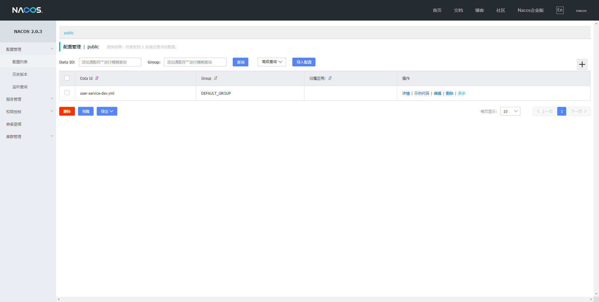

## Nacos

### 下载与使用
1. 下载地址

    [latest stable release.](https://github.com/alibaba/nacos/releases)

2. 解压文件进入bin目录

3. 运行

执行：`PS D:\developer\cloud\nacos\bin> .\startup.cmd -m standalone`

4. 安装完成后地址

打开：`http://127.0.0.1:8848/nacos/index.html`


### 使用

#### 参照官方文档：

[Nacos-discovery](https://github.com/alibaba/spring-cloud-alibaba/wiki/Nacos-discovery)
[Nacos-config](https://github.com/alibaba/spring-cloud-alibaba/wiki/Nacos-config)


#### 扩展配置：
```
        extension-configs:
          - dataId: user-service-ext-${spring.profiles.active}.yml
            group: REFRESH_GROUP
            refresh: true
```

### 遇到问题
1. 使用最新的springcloud无法读取bootstrap.yml文件
```
        <!-- 使用了bootstrap.yml文件之后需要引入bootstrap的依赖 -->
        <dependency>
            <groupId>org.springframework.cloud</groupId>
            <artifactId>spring-cloud-starter-bootstrap</artifactId>
            <version>3.0.2</version>
        </dependency>
```
2. Nacos中的配置


