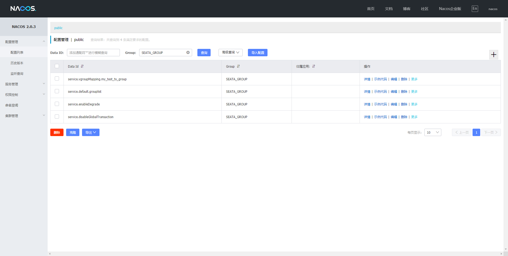

## Nacos
## Nacos作为注册中心时，需要往Nacos里面刷配置。

shell:
```bash
sh nacos-config.sh -h localhost -p 8848 -g SEATA_GROUP -t 5a3c7d6c-f497-4d68-a71a-2e5e3340b3ca -u username -w password
```

python:
```bash
python nacos-config.py localhost:8848
```

